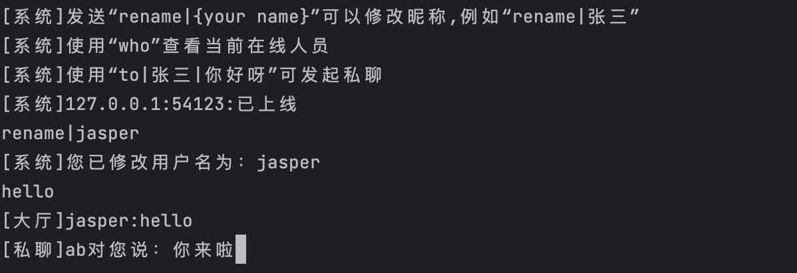

# IM-go
go服务实现的终端聊天功能，代码详解来源：[代码来源详解](https://cloud.tencent.com/developer/article/2191346 "代码来源详解")

## 效果


## 部署方式
1. 拉取代码
```
git clone https://github.com/DJP125142/IM-go
```
2. 启动服务
```
./build.sh
```
3. 创建客户端连接
```
// 新开一个终端窗口
nc 127.0.0.1 8888
```